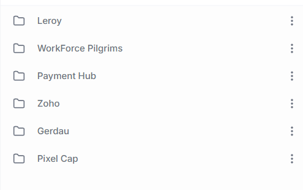

# Hoppscotch TSP Dev Workspace Doc
> 💡 **This document describes the general structure and configuration of the **TSP Dev Workspace at Hoppscotch**.This workspace is organized to centralize API requests, sharing them among collaborators and separating them by project.**

## Getting Started

- To begin using the TSP Dev workspace in Hoppscotch, you will need to create a Hoppscotch account. Visit [Hoppscotch](https://hoppscotch.io/) and sign up using your work email.
- After creating an account, reach out to **Solon Barbosa** (**sbarbosa@tsp.tech**) to be added to the workspace.

## **Folder Structure**

Each folder within the TSP Dev Workspace represents a distinct customer or project. Inside each folder, there are collections of API requests organized by functionality.

> 💡 **It is also possible to import requests from other applications**
>
> 
>
> 

> ⚠️ **If you need to change an existing request that is working, you can create a separate request, so that you don't have to change requests that are used by another user.**

## Environment Variables

In the TSP Dev workspace, we create a dedicated collection of environment variables for each project or customer, organized by environment. For projects with multiple environments (e.g., Development, Quality Assurance, Production), variable collections are labeled accordingly, such as:

- **"Paymenthub - Dev"**
- **"Paymenthub - QAS"**
- **"Paymenthub - PRD"**

If a project or customer does not have multiple environments, a single variable collection is created solely for the project or client. For example:

- **"Leroy"**
- **"Workforce"**

## Authentication Flow

Unlike some other API testing tools (e.g., Insomnia), Hoppscotch does not support calling another request before running the current request. This limitation means that it is not possible to automatically run an authentication request behind the scenes for requests that require a token.

To address this limitation, we save the authentication token in the environment variables after executing the login request. This is done in the **Tests** tab of the login request, where the token is programmatically stored in the environment variable after a successful login (as shown in the attached screenshot).

After executing the login request, you just need to execute the desired request, with the token env in the authorization field.

This approach minimizes manual intervention and allows for a more streamlined testing experience, with only the login request needing to be re-run when the token expires.

---

> 💡 If you have any further questions, you can access the [Hoppscotch documentation](https://docs.hoppscotch.io/documentation/getting-started/introduction) or contact **Solon Barbosa (sbarbosa@tsp.tech)** for additional assistance.